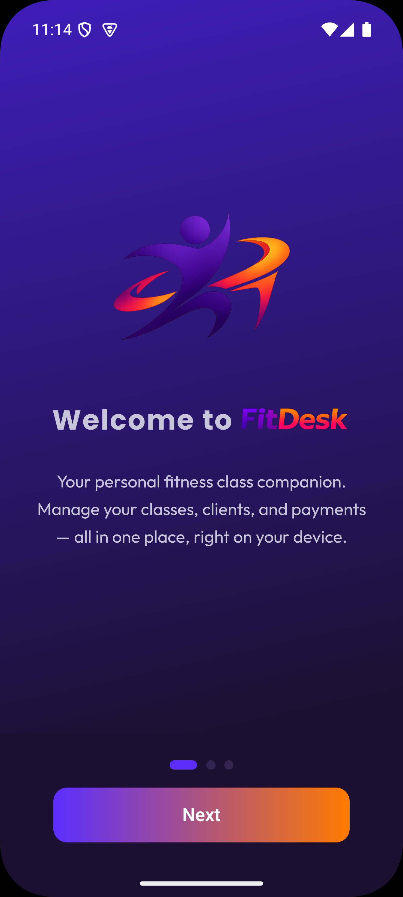
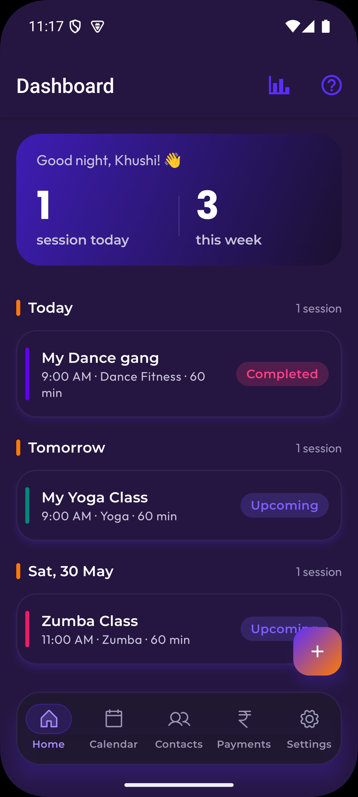
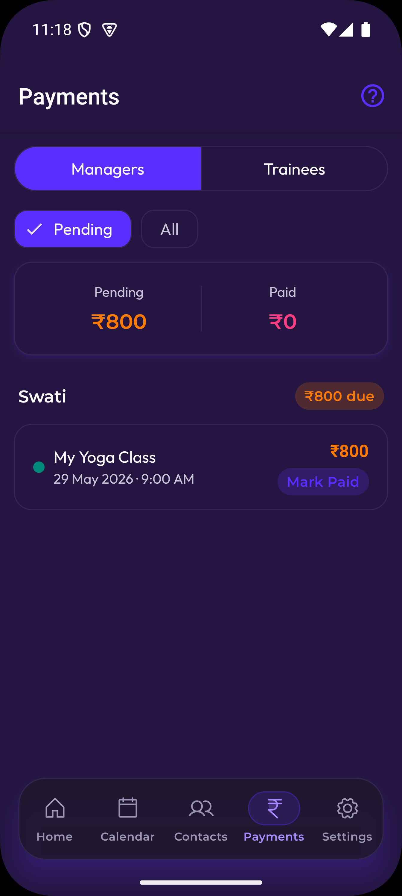
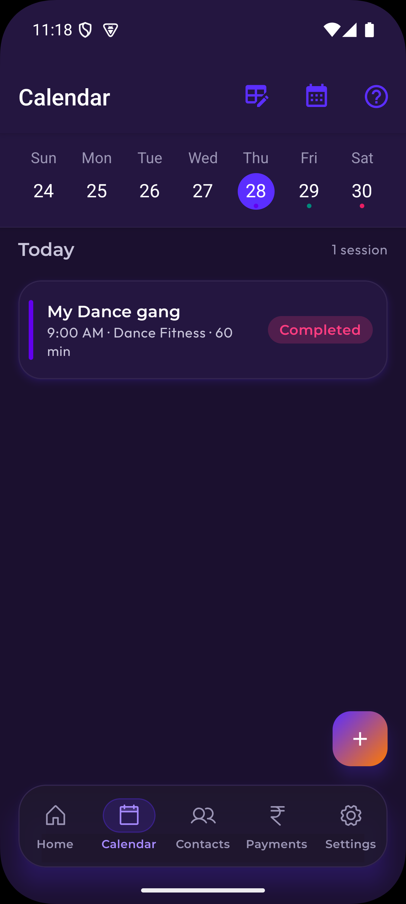
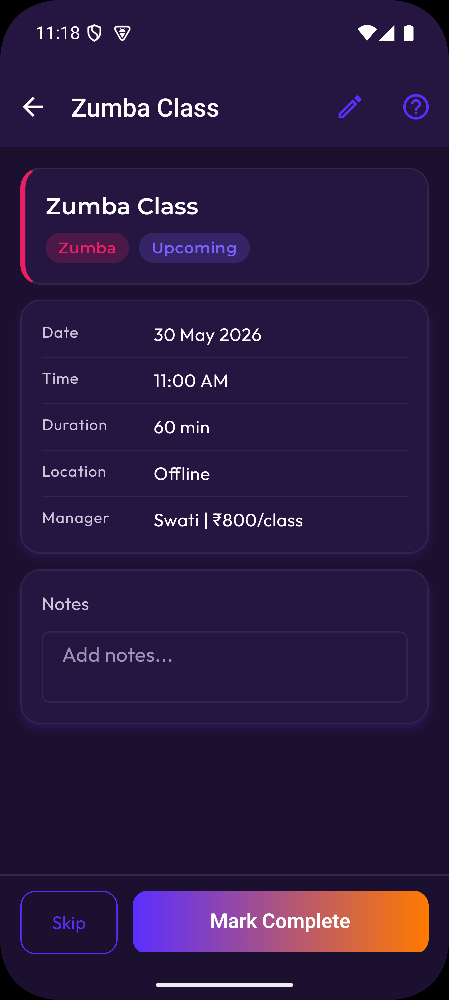
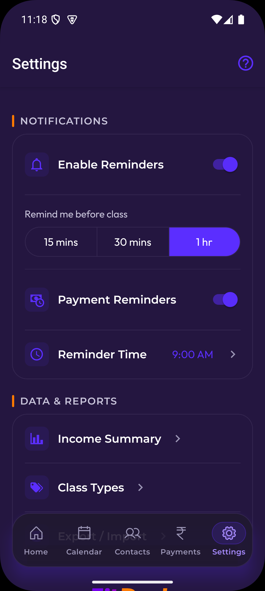
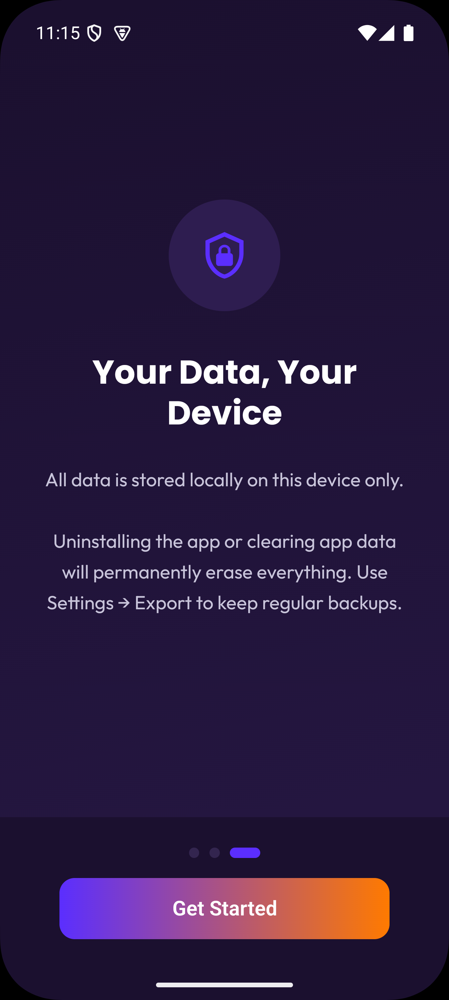

# FitDesk

**Your personal fitness class companion — built with love, for a freelance fitness instructor.**

<p align="center">
  
  &nbsp;&nbsp;
  
  &nbsp;&nbsp;
  
</p>

---

## The Story

My wife Khushi is a freelance Yoga, Zumba, and Dance Fitness instructor. She also runs personal training sessions at the gym. Over time I noticed her juggling multiple WhatsApp chats, notebooks, and her own memory just to track which manager assigned which class, when it was, and whether she'd been paid.

So I built FitDesk — a simple, local-first Android app that puts everything in one place: classes, clients, schedules, and payments. No account. No cloud. No subscription. Just her phone.

---

## What It Does

- **Dashboard** — today's sessions at a glance, upcoming week, trainee names on personal session cards
- **Calendar** — week view, session dots per day, trainee names shown inline for personal slots
- **Class Management** — recurring series (weekly, custom) or one-off adhoc sessions; class type picker works for both manager and personal sessions
- **Two class sources**: classes assigned by **managers** (Zumba centers, yoga studios) and **personal training** clients she manages herself
- **Trainee linkage** — link one or multiple trainees to a personal series; session cards show their names; sessions numbered "Session 3 / 12" based on active package
- **Session completion** — one-tap mark complete with trainee name + session count shown; auto-decrements package; no checkbox gymnastics
- **Centers / Venues** — add the gyms and studios you work at; attach them to series and sessions; see per-venue earnings in Reports
- **Contacts** — track managers (with per-class rate) and trainees (with monthly session packages); searchable pickers everywhere with inline add for class types and centers
- **Payments** — manager payments grouped by manager with drill-down per session; trainee packages tracked by month with sessions-used count; Reports accessible directly from the Payments screen
- **Notifications** — class reminders (15 min / 30 min / 1 hr before), payment reminders
- **Appearance** — choose an accent palette from Settings; buttons, tabs, pickers, highlights, and Phosphor icons stay consistent across the app
- **Export / Import** — SQLite backup files so data is never lost; imports refresh backup reminder state after restore

<p align="center">
  
  &nbsp;&nbsp;
  
  &nbsp;&nbsp;
  
</p>

---

## Privacy First

> **Your data never leaves your device.**

No login. No analytics. No backend server. Everything is stored locally using SQLite on your phone. Export your data anytime from Settings → Export / Import.

<p align="center">
  
</p>

---

## Tech Stack

| Layer | Tech |
|---|---|
| Framework | Expo (managed) SDK 56 |
| Language | TypeScript (strict) |
| UI | React Native Paper |
| Icons | phosphor-react-native |
| Storage | expo-sqlite (local only) |
| Notifications | expo-notifications (local only) |
| Navigation | React Navigation v7 |
| Calendar | react-native-calendars |

---

## Who Is This For?

Freelance fitness instructors who:
- Teach classes for multiple managers / studios / centers
- Run their own personal training clients
- Want to track payments without a spreadsheet
- Want their data on their device, not someone else's server

---

## Getting Started

```bash
git clone https://github.com/elanandkumar/FitDesk.git
cd FitDesk
npm install
npx expo run:android
```

> Android only. iOS not supported in this release.

Backups are exported from Settings → Data as `.fitdeskbackup` SQLite database files. Importing a backup replaces the local database, runs migrations, and refreshes the backup reminder timestamp.

---

## Release Workflow

FitDesk includes a release helper that builds the Android app, creates release notes from git commits, and tags the release.

For Play Store uploads, use the default Android App Bundle (`.aab`) format:

```bash
npm run release -- --version 1.2.3 --version-code 6 --update-version --commit-version --github-release
```

This updates the app version files and in-app What's New notes, commits the version bump, builds `bundleRelease`, generates notes in `dist/releases/`, creates an annotated tag like `v1.2.3`, and publishes a GitHub release when the `gh` CLI is available.

For a local APK build instead:

```bash
npm run release -- --format apk --github-release
```

Preview release notes without building, tagging, or publishing:

```bash
npm run release -- --version 1.2.3 --dry-run --allow-dirty
```

Release signing must be configured before building release artifacts. Copy `android/signing.properties.example` to `android/signing.properties` for local builds, or set the `FITDESK_UPLOAD_*` values as environment variables in CI.

---

## Contributing

This was built for one person — but if it helps more freelance instructors, that's even better.

Pull requests welcome. If you're a fitness instructor with a feature request, open an issue — I'd love to hear what would make this more useful for you.

---

## License

MIT — free to use, modify, and share.

---

*Built by Anand Kumar for Khushi — because love languages sometimes look like React Native.*
